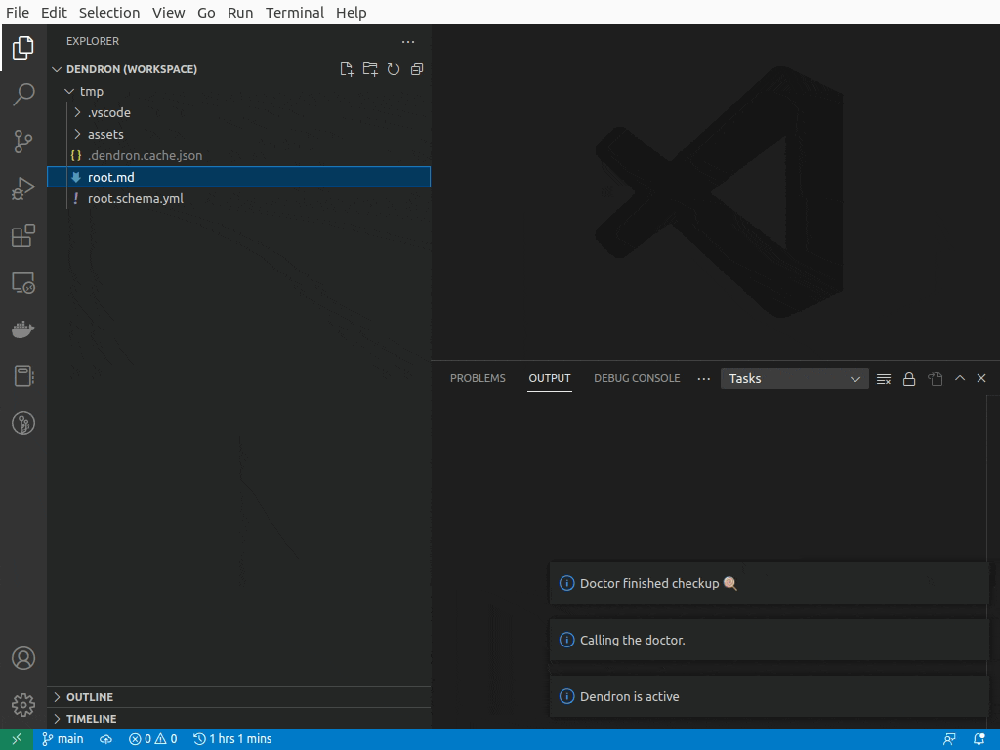

# VSCode Hypothes.is Markdown Sync Plugin

This extension allows you to download your hypothes.is annotations and store them in your markdown-based knowledge vault.

## Features

- Subscribe to and download a named hypothes.is user's annotations
- out-of-the-box [Dendron](https://dendron.so) integration ensures that downloaded notes are assigned unique IDs.
- Flexibly append new annotations to existing notes based on the `hypothesisURI` frontmatter field.

## Extension Settings

This extension contributes the following settings:

* `hypothesis.username`: The hypothesis username of the person whose notes you want to sync
* `hypothesis.filePattern`: The file naming convention that the generated markdown files should use. The plugin will substitute `%DOCSTUB%` for a stub representing the URL of the document being synchronised.
* `hypothesis.fileDir` if set then the plugin will store the generated markdown files in this subdirectory of your workspace folder.

### Dendron Integration

* `hypothesis.dendron.callDoctor` if enabled and the [Dendron](https://dendron.so) plugin is installed then the plugin will call the [Dendron doctor](https://wiki.dendron.so/notes/ZeC74FYVECsf9bpyngVMU/#fixfrontmatter)_to have it automatically add relevant metadata (e.g. id, created, updated attributes) to any newly created notes.

## Release Notes

Users appreciate release notes as you update your extension.

### 0.0.2

 - Updated the README with better description and a GIF of how the plugin works
 

### 0.0.1

Initial release of the extension and initial feature set:
 - Set your hypothesis username
 - Use the `Sync Hypothesis Annotations` command to download all hypothesis annotations and store them as markdown notes.

